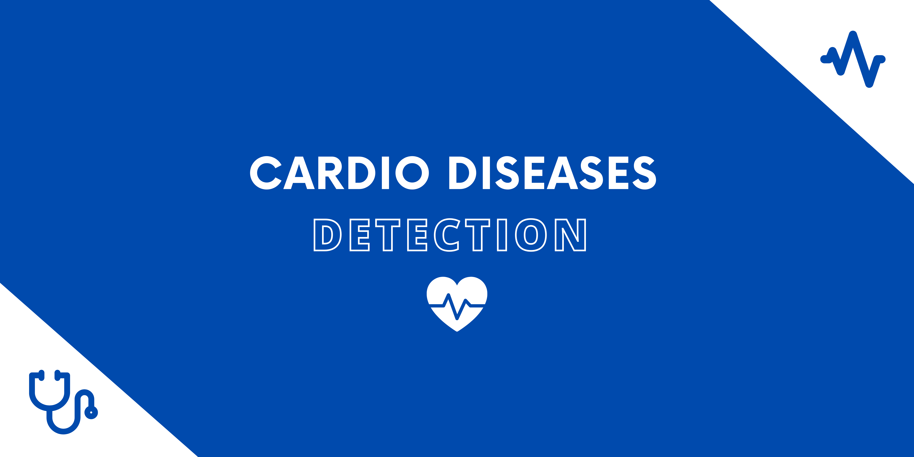

<p align="center">
  
  
  
  
  
</p>

💻 Conteúdos
=================
  * 🏠 [Sobre o projeto](#-sobre-o-projeto)
  * 🚀 [Como executar](#-como-executar)
  * ❓  [Questão de negócio](#-questão-de-negócio)
  * 📝 [Desenvolvimento da solução](#-desenvolvimento-da-solução)
  * 🔮  [Resultados](#-resultados)
  * ✅  [Telegram Bot](#-telegram-bot)
  * 🦸 [Autora](#-autora)

---

## 🏠 Sobre o projeto
Cardio Disease Prediction é um projeto que visa prever o risco de doença cardiovasculares em um paciente. Os dados para o problema foram obtidos do [Kaggle](https://www.kaggle.com/c/rossmann-store-sales/data).

---

## 🚀 Como executar

### Pré-requisitos

Antes de começar, você vai precisar ter instalado em sua máquina as seguintes ferramentas:
[Git](https://git-scm.com) e [Python](https://www.python.org/).

#### 🎲 Rodando localmente

```bash
# Clone este repositório
$ git clone https://github.com/nathaliaop/cardio-disease-predict.git

# Acesse a pasta do projeto no terminal/cmd
$ cd cardio-disease-predict

# Instale as dependências do ambiente virtual
$ pip install -r requirements.txt

# Treinando o modelo
$ python kernel_svm.py
```

---

## 🔮 Resultados
Por meio do site Cardio Predict (https://cardio-predict.vercel.app) é possível inserir as informações dos pacientes e obter o diagnóstico.

## 🦸 Autora


Nathália Oliveira Pereira

<div> 
  <a href = "mailto:np.nathaliapereira@gmail.com"></a>
  <a href="https://www.linkedin.com/in/nathalia-oliveira-pereira" target="_blank"></a> 
</div>
